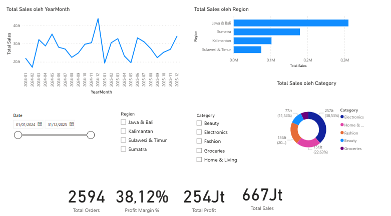
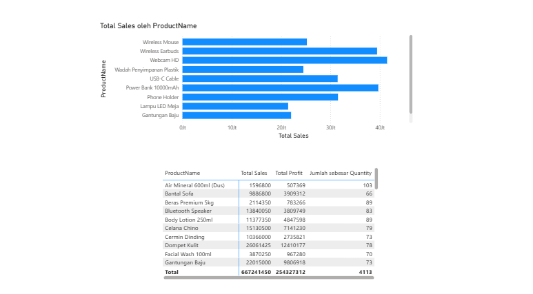
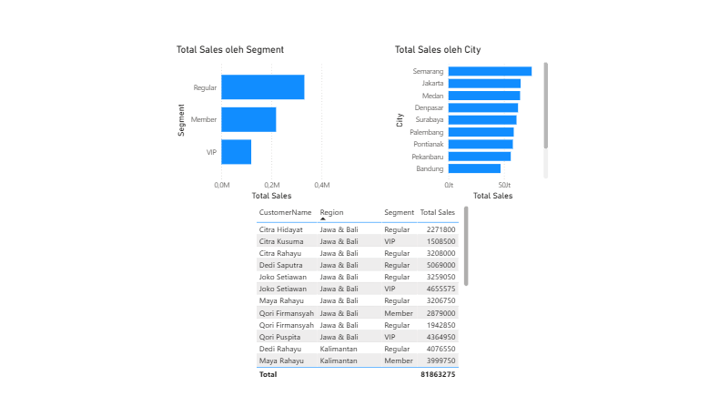

# 📊 Sales Performance Dashboard — Power BI

Dashboard interaktif untuk memantau performa penjualan, profitabilitas, dan perilaku pelanggan ritel multi-kategori, dibangun end-to-end mulai dari data mentah sampai laporan siap presentasi.


---

## 🖼️ Preview

*Dashboard dijalankan lokal via Power BI Desktop — buka file `.pbix` di folder `dashboard/` untuk eksplorasi interaktif penuh (slicer, filter, cross-highlighting antar chart).*


| Overview | Product Performance | Regional Analysis |
|---|---|---|
|  |  |  |


---

## 📌 Latar Belakang

**Nusantara Mart** adalah studi kasus ritel multi-kategori (Electronics, Fashion, Groceries, Home & Living, Beauty) dengan pelanggan tersebar di 12 kota besar Indonesia. Tim bisnis membutuhkan cara cepat untuk memantau performa penjualan tanpa harus membuka ribuan baris data mentah di Excel setiap kali ingin mengambil keputusan.

**Tujuan proyek:**
- Mengubah data transaksi mentah menjadi dashboard interaktif yang mudah dibaca
- Mengidentifikasi kategori produk & wilayah dengan performa terbaik/terlemah
- Memantau tren penjualan dari waktu ke waktu, termasuk efek musiman
- Menghasilkan insight yang bisa langsung ditindaklanjuti tim bisnis

---

## 🗂️ Dataset

Dataset (`data/Nusantara_Mart_Sales_Data.xlsx`) berisi 3 tabel yang saling berelasi:

| Tabel | Isi | Baris |
|---|---|---|
| `Sales` | Transaksi penjualan 2024–2025 | 2.612 |
| `Products` | Master data produk (5 kategori) | 50 |
| `Customers` | Master data pelanggan (12 kota, 3 segmen) | 320 |

Data sengaja dibuat menyerupai kondisi nyata — ada duplikat, nilai kosong, dan input error — supaya proses *data cleaning* di Power Query benar-benar bermakna, bukan sekadar formalitas.

> Studi kasus & nama bisnis bersifat fiktif, dibuat khusus untuk latihan analisis data end-to-end.

---

## 🛠️ Tools & Skills

- **Power Query** — data cleaning & transformation (handle null, duplikat, standarisasi teks)
- **Power BI Data Modeling** — star schema, relationship antar tabel, tabel Date custom
- **DAX** — measures untuk KPI, time intelligence (YoY growth, MTD), dan ranking
- **Power BI Desktop & Service** — report design, publish, sharing

---

## 🔄 Alur Pengerjaan

```
Data Mentah (Excel)
      │
      ▼
Power Query  →  cleaning, transformasi, kolom kustom
      │
      ▼
Data Modeling  →  star schema, relasi tabel, tabel Date
      │
      ▼
DAX Measures  →  Total Sales, Profit Margin %, YoY Growth, dll
      │
      ▼
Report Design  →  3 halaman (Overview, Product, Regional)
      │
      ▼
Publish  →  Power BI Service (Publish to Web)
```

Dokumentasi lengkap tiap tahap (termasuk seluruh formula DAX) ada di [`docs/Panduan_Project_PowerBI.docx`](docs/Panduan_Project_PowerBI.docx).

---

## 📈 Key Insights

- Penjualan memuncak pada **November–Desember** (efek akhir tahun), jadi momentum tepat untuk kampanye promosi musiman
- Kategori dengan **profit margin tertinggi belum tentu** kategori dengan Total Sales tertinggi — berpengaruh terhadap strategi penetapan harga
- Segmen **VIP menyumbang porsi penjualan yang tidak proporsional** terhadap jumlah pelanggannya — layak dipertahankan lewat program loyalitas
- Performa antar region bervariasi signifikan, dengan **Jawa & Bali** sebagai kontributor Total Sales terbesar

---

## 📁 Struktur Repository

```
├── data/
│   └── Nusantara_Mart_Sales_Data.xlsx      # dataset mentah (3 sheet)
├── dashboard/
│   └── Sales_Performance_Dashboard.pbix     # file Power BI
├── docs/
│   └── Panduan_Project_PowerBI.docx         # dokumentasi alur & DAX lengkap
├── screenshots/
│   ├── overview.png
│   ├── product-performance.png
│   └── regional-analysis.png
└── README.md
```

---

## 🚀 Cara Menjalankan

1. Clone atau download repository ini
2. Buka `dashboard/Sales_Performance_Dashboard.pbix` dengan [Power BI Desktop](https://powerbi.microsoft.com/desktop/) (gratis, Windows only)
3. Jika ada permintaan update data source, arahkan ke `data/Nusantara_Mart_Sales_Data.xlsx`
4. Klik **Refresh** untuk memuat ulang data
5. Eksplor 3 halaman: Overview, Product Performance, Regional Analysis — coba klik slicer tanggal/kategori/region untuk lihat cross-filtering

---

## 📬 Connect

**Bima Maulana** — Aspiring Data Analyst

- 📧 bimamaulana49@gmail.com
- 💼 [linkedin.com/in/bima-maulana-id](https://www.linkedin.com/in/bima-maulana-id/)
- 💻 [github.com/BimaaMaulana](https://github.com/BimaaMaulana)
